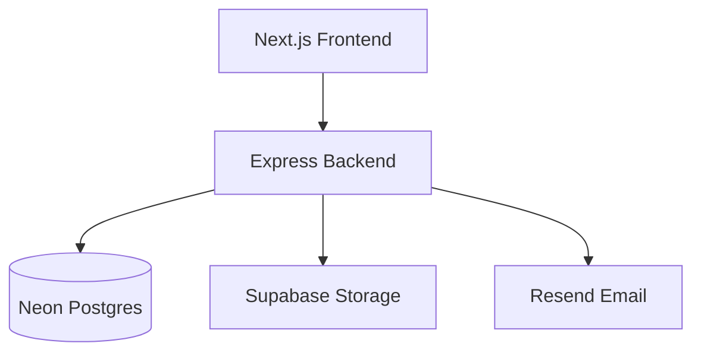
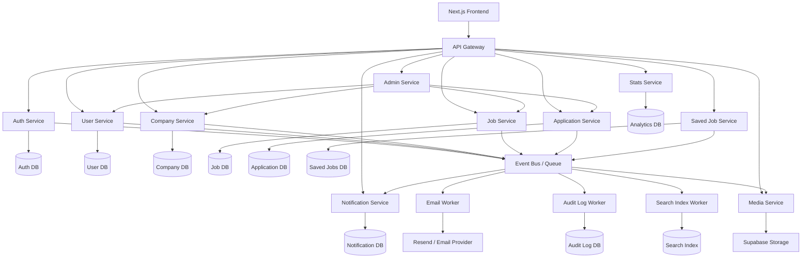
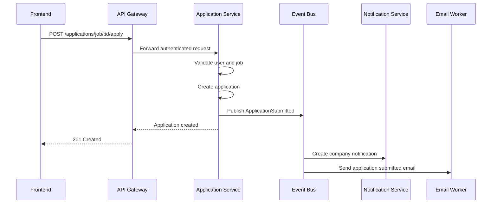
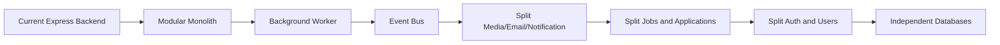

# Complete Microservice Architecture

This document shows how the current NextHire project could evolve from one Express backend into a complete microservice architecture.

## Current Project Shape



The current backend is a modular monolith. It has separate route/controller/service files, but everything deploys as one API.

## Complete Microservice Target



## Service Responsibilities

### API Gateway

- Receives frontend requests.
- Handles CORS and request limits.
- Routes requests to internal services.
- Adds request IDs for tracing.
- Can verify access tokens before forwarding requests.

### Auth Service

- Register.
- Login.
- Logout.
- Refresh token.
- Password reset.
- JWT/session validation.
- Owns password hashes and refresh token logic.

### User Service

- User profiles.
- Avatar and resume metadata.
- User stats.
- Public profile data.
- User role/profile reads for other services.

### Company Service

- Company profiles.
- Company ownership rules.
- Company logo, cover, gallery metadata.
- Company public detail.
- Company admin profile updates.

### Job Service

- Job create/update/delete.
- Public job list.
- Public job detail.
- Job search and filters.
- Job status open/closed.

### Application Service

- Apply to job.
- Withdraw application.
- View seeker applications.
- View applicants for a company job.
- Update application status.
- Enforces company/job ownership.

### Saved Job Service

- Save job.
- Unsave job.
- List saved jobs for a seeker.
- Enforces unique `userId + jobId`.

### Notification Service

- Stores in-app notifications.
- Tracks read/unread state.
- Builds notification feed.
- Consumes events such as application submitted and status changed.

### Media Service

- Upload avatar.
- Upload resume.
- Upload company logo, cover, and gallery assets.
- Delete old assets.
- Runs asset cleanup jobs.
- Integrates with Supabase Storage.

### Stats Service

- Platform stats.
- Company dashboard stats.
- Seeker dashboard stats.
- Aggregates data from events or read models.

### Admin Service

- User management.
- Company management.
- Platform moderation.
- Role and company assignment workflows.
- Calls other services instead of directly mutating their databases.

### Email Worker

- Welcome emails.
- Password reset emails.
- Application submitted emails.
- Application status update emails.

### Search Worker

- Indexes jobs and companies.
- Supports full-text search.
- Can later support vector search or recommendation search.

### Audit Log Worker

- Records sensitive actions.
- Tracks role changes.
- Tracks admin actions.
- Tracks company/job deletion.

## Event Flow



## Data Ownership

In a complete microservice system, each service owns its data.

```txt
Auth Service         -> auth users, credentials, sessions
User Service         -> user profiles
Company Service      -> companies and company metadata
Job Service          -> jobs
Application Service  -> applications
Saved Job Service    -> saved jobs
Notification Service -> notifications
Stats Service        -> analytics/read models
Audit Worker         -> audit logs
```

Services should not directly write to another service database. They should call service APIs or consume events.

## Practical Migration Path

Do not split everything at once.



Recommended order:

1. Keep the current backend as a modular monolith.
2. Move email and asset cleanup into a background worker.
3. Add an event bus or queue.
4. Extract notification/media/email services first.
5. Extract job/application services later.
6. Split databases only when the service boundaries are stable.

## Recommended First Extraction

The first real microservice should be:

```txt
Notification + Email + Asset Cleanup Worker
```

Why:

- It can run asynchronously.
- It does not need to block user requests.
- It reduces risk compared with splitting auth first.
- It gives the project real microservice behavior without breaking core business logic.

## Warning

Full microservices add complexity:

- More deployments.
- More environment variables.
- More network failures.
- More duplicated auth checks.
- Harder local development.
- Harder database migrations.
- Harder debugging.

For this project, the best engineering path is:

```txt
Modular monolith now.
Worker service next.
Complete microservices only if the project grows.
```
