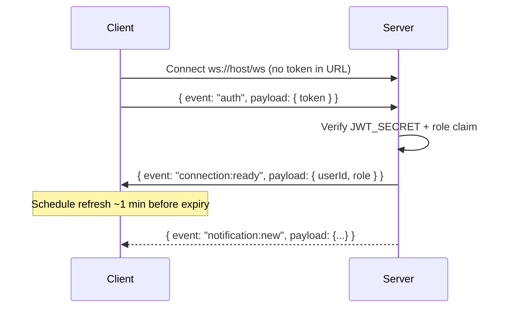

# WebSocket Integration Guide

Complete reference for realtime notifications in the Job Portal project.

**Read this file before changing any WebSocket or notification code.**

---

## Contents

1. [Quick Start](#1-quick-start)
2. [What This Feature Does](#2-what-this-feature-does)
3. [Architecture](#3-architecture)
4. [Auth: Access vs Refresh Token](#4-auth-access-token-vs-refresh-token)
5. [WebSocket Auth Detail](#5-websocket-auth-detail)
6. [Realtime Events](#6-realtime-events)
7. [Backend Reference](#7-backend-reference)
8. [Frontend Reference](#8-frontend-reference)
9. [Testing](#9-testing)
10. [Deployment](#10-deployment)
11. [How To Add A New Realtime Event](#11-how-to-add-a-new-realtime-event)
12. [Done vs Not Done](#12-done-vs-not-done)
13. [Do Not Change Lightly](#13-do-not-change-lightly)
14. [Related Docs](#14-related-docs)

---

## At a Glance

| Topic | Rule |
| --- | --- |
| Payloads | Build in `notification.service.js` only |
| Emit timing | After DB action succeeds |
| WebSocket auth | Access token only (never refresh token) |
| Preferred connect | `ws://host/ws` + first-message `auth` frame |
| Fallback | HTTP `GET /api/v1/notifications` always works |

---

## 1. Quick Start

### Repositories

| Project | Local path | Branch | Remote |
| --- | --- | --- | --- |
| Backend | `C:\job-portal\backend` | `websocket` | `github.com/Devvfong/backend-job-portal` |
| Frontend | `C:\Users\devqii\Downloads\job-portal-ui` | `websocket` | `github.com/Devvfong/job-portal-ui` |

The frontend is a **separate repo**. It is not inside `C:\job-portal`.

### Run locally

```bash
# Terminal 1 — Backend
cd C:\job-portal\backend
git checkout websocket
npm install
npm run dev

# Terminal 2 — Frontend
cd C:\Users\devqii\Downloads\job-portal-ui
git checkout websocket
npm install
npm run dev
```

### Environment

Backend `.env`:

```env
DATABASE_URL=...
JWT_SECRET=...
JWT_REFRESH_SECRET=...
SESSION_SECRET=...
CORS_ORIGINS=http://localhost:3000
```

Frontend `.env.local`:

```env
NEXT_PUBLIC_API_URL=http://localhost:5000/api/v1
```

### URLs in local dev

```text
Frontend   http://localhost:3000
Backend    http://localhost:5000
WebSocket  ws://localhost:5000/ws
```

---

## 2. What This Feature Does

HTTP `GET /api/v1/notifications` still loads the notification list.

WebSocket adds **live pushes** when something important happens:

- seeker applies to a job
- company admin gets a new applicant
- seeker application status changes
- seeker withdraws an application (notification removed)
- new open job is created (pushed to connected seekers)
- super admin sees platform application activity

If WebSocket is down, the app still works through HTTP and email.

---

## 3. Architecture

```text
Browser
  |
  +-- NotificationBell
  |     |
  |     +-- GET /api/v1/notifications  (initial load)
  |     +-- useRealtimeNotifications   (live updates)
  |
  v
WebSocket /ws
  ^
  |
realtime/websocket.js  (transport only)
  ^
  |
application.controller.js / job.controller.js  (emit after success)
  ^
  |
notification.service.js  (single payload builder)
  ^
  |
Prisma / Postgres
```

### Layer rules

| Layer | Job |
| --- | --- |
| `notification.service.js` | Build notification payloads. Fetch HTTP notification lists. |
| `notification.controller.js` | Return HTTP JSON only. |
| `application.controller.js` | Run business action, then emit realtime events. |
| `job.controller.js` | Create job, then emit new-job event to seekers. |
| `realtime/websocket.js` | Auth, client tracking, send messages. No Prisma. No payload building. |
| `useRealtimeNotifications.ts` | Connect, auth, refresh, reconnect. |
| `NotificationBell.tsx` | Show list. Merge HTTP + realtime. Track read state. |

### Golden rules

1. Build every notification payload in `notification.service.js`.
2. HTTP and WebSocket must use the **same builders**.
3. Emit only **after** the database action succeeds.
4. Never put business logic inside `websocket.js`.

---

## 4. Auth: Access Token vs Refresh Token

This is the most important part to understand.

### Two tokens, two jobs

| Token | Expires | Stored where | Used for |
| --- | --- | --- | --- |
| **Access token** | 5 minutes | `localStorage`, `token` cookie, `Authorization: Bearer` | API routes, WebSocket auth |
| **Refresh token** | 1 day | httpOnly `jwt` cookie (backend sets this) | `POST /api/v1/auth/refresh` only |

### Access token payload (required for WebSocket)

```json
{
  "id": 4,
  "role": "job_seeker",
  "exp": 1710000000
}
```

### Refresh token payload

```json
{
  "id": 4,
  "exp": 1710000000
}
```

Refresh tokens have **no `role`**. WebSocket must reject them.

### Cookie rules

| Cookie name | Owner | Purpose |
| --- | --- | --- |
| `token` | Frontend | Access token for dashboard route protection |
| `jwt` | Backend only | Refresh token. httpOnly. Frontend must never write this. |

### Auth flows (current code)

#### Login / register

```text
Backend returns { user, token }
  -> store user in Zustand + localStorage
  -> store access token in localStorage + token cookie
  -> backend sets httpOnly jwt refresh cookie
```

#### API request when access token expired

```text
API returns 401
  -> POST /auth/refresh (browser sends jwt cookie)
  -> new access token
  -> persistAccessToken() updates localStorage, token cookie, Zustand
  -> retry original request
```

If refresh fails:

```text
clearAccessSession()
  -> remove token + user from storage
  -> Zustand user/token set to null
```

#### App reload (`auth.store.ts init`)

```text
Read access token from localStorage
  -> if expired: try /auth/refresh first
  -> if refresh works: load /auth/me and stay logged in
  -> if refresh fails: clear session
```

#### WebSocket connection



Legacy support: `ws://host/ws?token=<access_token>` still works (URL auth skips the auth frame).

---

## 5. WebSocket Auth Detail

### Preferred client auth (frontend uses this)

**Step 1.** Connect:

```text
ws://localhost:5000/ws
```

**Step 2.** Send immediately after open:

```json
{
  "event": "auth",
  "payload": {
    "token": "<access_token>"
  }
}
```

**Step 3.** Wait for:

```json
{
  "event": "connection:ready",
  "payload": {
    "userId": 4,
    "role": "job_seeker"
  }
}
```

### Server rejects connection when

- no auth within 10 seconds
- token missing `id` or `role`
- token fails JWT verify
- user not found in database

Rejected connections close with code `1008`.

### Frontend auth files

| File | Role |
| --- | --- |
| `lib/auth-session.ts` | `persistAccessToken()`, `clearAccessSession()`, sync to Zustand |
| `store/auth.store.ts` | Login state, `init()` refresh-before-logout |
| `lib/api-backend.ts` | Bearer header + 401 refresh interceptor |
| `lib/realtime.ts` | `refreshAccessToken()` for WebSocket |
| `hooks/useRealtimeNotifications.ts` | Send auth frame, reconnect, refresh |

---

## 6. Realtime Events

| Event | Direction | When it fires | Who receives it |
| --- | --- | --- | --- |
| `auth` | client → server | right after socket open | server only |
| `connection:ready` | server → client | auth success | connecting client |
| `notification:new` | server → client | application submitted | seeker, company, super_admin |
| `notification:new` | server → client | status updated | seeker |
| `notification:new` | server → client | open job created (`status === "open"`) | all connected `job_seeker` |
| `notification:remove` | server → client | application withdrawn | seeker who withdrew only |

**Note:** Company admins and super admins do not receive realtime updates for status changes or withdraws. They still see data via HTTP refresh.

---

## 7. Backend Reference

### Main files

```text
src/server.js                          # calls initRealtime(server)
src/realtime/websocket.js              # WebSocket server at /ws
src/services/notification.service.js   # payload builders
src/controllers/application.controller.js
src/controllers/job.controller.js
src/controllers/notification.controller.js
nginx/default.conf                     # /ws upgrade proxy
features/realtime/test-websocket.js  # manual smoke test
```

### WebSocket exports

```js
initRealtime(server)
emitNotificationToUser(userId, notification)
emitNotificationToCompany(companyId, notification)
emitNotificationToRole(role, notification)
removeNotificationFromUser(userId, payload)
REALTIME_EVENTS
```

### Client tracking

| Map | Key | Used for |
| --- | --- | --- |
| `clientsByUser` | `userId` | seeker status updates, withdraw removal |
| `clientsByCompany` | `companyId` | new applicant alerts |
| `clientsByRole` | `role` | new jobs to seekers, super_admin alerts |

Only **connected** clients receive pushes. No connected client = no realtime message (HTTP still works).

Server sends a heartbeat ping every 30 seconds. Clients that do not respond are disconnected.

### Notification builders

```js
buildSeekerApplicationNotification(application, eventTime?)
buildNewApplicantNotification(application)
buildSuperAdminApplicationNotification(application)
buildNewJobNotification(job)
buildApplicationRemovalPayload(applicationId)
getNotificationsForUser(user)
```

### Emit points

**Apply** (`application.controller.js`):

```js
emitNotificationToUser(userId, buildSeekerApplicationNotification(application));
emitNotificationToCompany(companyId, buildNewApplicantNotification(application));
emitNotificationToRole("super_admin", buildSuperAdminApplicationNotification(application));
```

**Status update**:

```js
emitNotificationToUser(
  application.userId,
  buildSeekerApplicationNotification(application, new Date()),
);
```

**Withdraw**:

```js
removeNotificationFromUser(userId, buildApplicationRemovalPayload(application.id));
```

**Create job** (`job.controller.js`) — only when `status === "open"`:

```js
if (jobWithCompany?.status === "open") {
  emitNotificationToRole("job_seeker", buildNewJobNotification(jobWithCompany));
}
```

### Required application shape for builders

```js
{
  id: number,
  status: "pending" | "reviewed" | "accepted" | "rejected",
  appliedDate: Date,
  userId: number,
  user: { name: string, avatar?: string },
  job: {
    title: string,
    companyId: number,
    company: { companyName: string, logo?: string }
  }
}
```

`applyToJobService()` and `updateApplicationStatusService()` already return this shape.

### Notification ID format

| Case | ID |
| --- | --- |
| Pending application | `app-pending-{applicationId}` |
| Reviewed | `app-reviewed-{applicationId}` |
| Accepted | `app-accepted-{applicationId}` |
| Rejected | `app-rejected-{applicationId}` |
| New applicant (company) | `new-applicant-{applicationId}` |
| Super admin activity | `admin-applicant-{applicationId}` |
| New job | `new-job-{jobId}` |

Payloads also include `applicationId` or `jobId` for deduplication on the frontend.

### Message envelope

```json
{
  "event": "notification:new",
  "payload": {
    "id": "app-pending-12",
    "applicationId": 12,
    "type": "applied",
    "icon": "check",
    "title": "Application Submitted",
    "message": "You applied for \"Frontend Engineer\" at Acme Corp. Good luck!",
    "time": "2026-06-07T12:00:00.000Z",
    "createdAt": "2026-06-07T12:00:00.000Z",
    "read": false,
    "avatar": "https://...",
    "link": "/dashboard/seeker/applications"
  }
}
```

Remove event:

```json
{
  "event": "notification:remove",
  "payload": {
    "applicationId": 12,
    "ids": [
      "app-pending-12",
      "app-reviewed-12",
      "app-accepted-12",
      "app-rejected-12",
      "new-applicant-12"
    ]
  }
}
```

---

## 8. Frontend Reference

### Main files

```text
lib/realtime.ts
lib/auth-session.ts
lib/notification-read.ts
hooks/useRealtimeNotifications.ts
components/shared/NotificationBell.tsx
store/auth.store.ts
lib/api-backend.ts
proxy.ts
types/index.ts
```

### Hook usage (current API)

```tsx
useRealtimeNotifications({
  onNotification: (notification) => {
    setNotifications((current) =>
      withReadState(prependNotification(current, notification)),
    )
  },
  onRemove: (payload) => {
    setNotifications((current) => removeNotifications(current, payload))
  },
})
```

### Hook behavior

1. Runs only when `useAuthStore().token` exists.
2. Opens `ws://<api-host>/ws` with **no token in URL**.
3. Sends `{ event: "auth", payload: { token } }` on open.
4. Waits for `connection:ready`.
5. Refreshes access token about 1 minute before expiry.
6. Reconnects with backoff on disconnect.
7. On close code `1008`, tries refresh then reconnects.

### Notification bell flow

```text
1. Wait for auth token
2. GET /notifications (server returns up to 15 items)
3. Apply local read-state from localStorage
4. Listen for notification:new -> prepend (dedupe by id + applicationId, keep 15 max)
5. Listen for notification:remove -> remove matching items
6. When dropdown opens -> mark first 8 visible items as read
7. UI renders first 8 notifications in the dropdown
```

### Dedup logic

`prependNotification()` removes:

- same `id`
- same `applicationId` (fixes status-change duplicates)

### Read state

Stored in `localStorage` via `lib/notification-read.ts`.

This is **frontend only**. Not saved in Postgres yet.

---

## 9. Testing

### Backend syntax

```bash
cd C:\job-portal\backend
node --check src/server.js
node --check src/realtime/websocket.js
node --check src/services/notification.service.js
node --check src/controllers/application.controller.js
```

### Frontend checks

```bash
cd C:\Users\devqii\Downloads\job-portal-ui
npm run lint
npx tsc --noEmit
npm run build
```

### WebSocket smoke test

```bash
cd C:\job-portal\backend
ACCESS_TOKEN=<valid_access_token> node features/realtime/test-websocket.js
```

Expected output includes:

```text
Socket opened, sending auth frame...
Message: {"event":"connection:ready","payload":{"userId":...,"role":"..."}}
```

### End-to-end manual test

1. Login as `job_seeker`.
2. Confirm bell loads notifications.
3. Apply to an open job -> seeker sees instant "Application Submitted".
4. Login as `company_admin` for that company -> sees "New Applicant".
5. Update status to `reviewed` -> seeker sees updated notification (old pending one replaced).
6. Withdraw application -> seeker notification disappears.
7. Create a new open job as company admin -> connected seekers get "New Job Match".
8. Refresh page -> HTTP `/notifications` still matches.

### Route auth for testing

| Route | Roles |
| --- | --- |
| `POST /api/v1/applications/job/:id/apply` | `job_seeker` |
| `PATCH /api/v1/applications/:id/status` | `company_admin` |
| `DELETE /api/v1/applications/:id` | `job_seeker` (own application) |
| `POST /api/v1/jobs/create` | `company_admin` |
| `GET /api/v1/notifications` | any logged-in user |

`super_admin` bypasses `authorize()` middleware, but normal tests should use seeker + company admin accounts.

---

## 10. Deployment

### Nginx `/ws` block

File: `nginx/default.conf`

Required headers:

```nginx
proxy_set_header Upgrade $http_upgrade;
proxy_set_header Connection "upgrade";
```

### Production WebSocket URL

```text
wss://your-api-domain/ws
```

Derived from `NEXT_PUBLIC_API_URL` on the frontend.

### CORS defaults in `server.js`

```text
https://jobportal.devqii.me
https://job-portal.devqii.me
http://localhost:3000
http://127.0.0.1:3000
```

Plus values from `CORS_ORIGINS`.

### Production checklist

- [ ] `JWT_SECRET` set
- [ ] `JWT_REFRESH_SECRET` set
- [ ] `SESSION_SECRET` set
- [ ] `CORS_ORIGINS` includes frontend domain
- [ ] Refresh cookie works on deployed domain (same-site / secure settings)
- [ ] Nginx forwards `/ws` with upgrade headers

---

## 11. How To Add A New Realtime Event

Do these steps in order:

1. Add payload builder in `notification.service.js`.
2. Make sure the service returns the fields that builder needs.
3. Emit from the controller after the DB action succeeds.
4. Add event name to `REALTIME_EVENTS` (backend + frontend) if new.
5. Handle the event in `useRealtimeNotifications.ts`.
6. Update UI state in the consuming component.
7. Update this guide.

Do not:

- query Prisma inside `websocket.js`
- build different shapes in controller vs service
- authenticate WebSocket with refresh cookies
- emit before the mutation succeeds

---

## 12. Done vs Not Done

### Done

- WebSocket server at `/ws`
- First-message auth + legacy `?token=` support
- Access/refresh token separation
- Token refresh on init, API 401, and WebSocket reconnect
- Shared notification payloads
- Apply, status, withdraw, new job, super admin emits
- Status-change dedupe via `applicationId`
- Frontend read state in `localStorage`
- Nginx upgrade proxy
- Smoke test script

### Not done yet

| Item | Why it still matters |
| --- | --- |
| Postgres `Notification` table | notifications are computed, not stored |
| DB read/unread state | read state is browser-only today |
| Multi-server WebSocket | in-memory client map does not scale horizontally |
| Automated integration tests | only manual smoke test exists |
| Rate limiting on `/ws` | optional hardening |

---

## 13. Do Not Change Lightly

- access-token-only WebSocket auth
- `token` vs `jwt` cookie separation
- shared builders in `notification.service.js`
- notification ID formats
- `applicationId` on application-related payloads
- HTTP `/api/v1/notifications` fallback
- emit-after-success pattern in controllers

---

## 14. Related Docs

```text
features/auth_hardening/AUTH_FLOW_OVERVIEW.md
features/auth_hardening/API_CONTRACT_NOTES.md
features/final_preview/01_api_endpoints_roles_authorization.md
features/architecture/MICROSERVICE_ARCHITECTURE.md
```