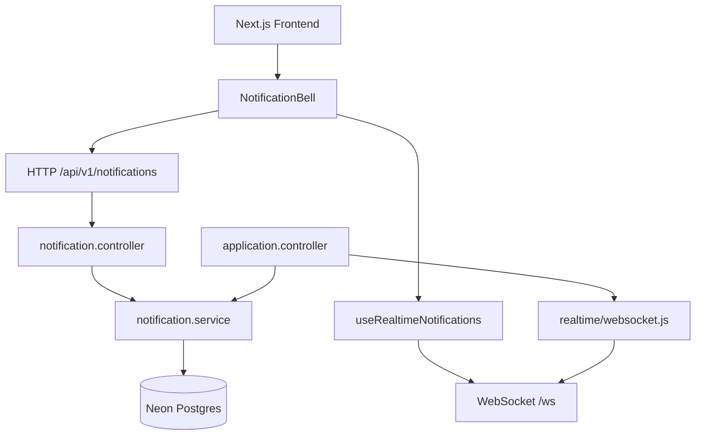

# WebSocket Integration Guide

This document is the handoff reference for realtime notifications in the Job Portal project.

Use this file first before changing WebSocket code.

---

## Agent Handoff

### Repository locations

| Repo | Path | Branch |
| --- | --- | --- |
| Backend | `C:\job-portal\backend` | `websocket` |
| Frontend | `C:\Users\devqii\Downloads\job-portal-ui` | check with `git branch --show-current` |

The frontend is **not** inside `C:\job-portal`. It is a separate project in Downloads.

### Current backend git state

Branch:

```text
websocket
```

Important changed/new files for WebSocket work:

```text
M  nginx/default.conf
M  src/controllers/application.controller.js
M  src/controllers/notification.controller.js
M  src/realtime/websocket.js
?? features/realtime/WEBSOCKET_INTEGRATION_GUIDE.md
?? features/...
?? src/services/notification.service.js
```

Before continuing, run:

```bash
cd C:\job-portal\backend
git status -sb
```

### What is complete vs what is next

| Status | Item |
| --- | --- |
| Done | Backend `/ws` server, auth, heartbeat, client tracking |
| Done | Shared `notification.service.js` payloads |
| Done | Realtime emits on apply + status update |
| Done | Frontend hook, bell UI, token refresh, HTTP fallback |
| Done | Nginx `/ws` upgrade in `nginx/default.conf` |
| Not done | Persisted notifications table |
| Not done | Read/unread DB state |
| Not done | Automated `/ws` integration tests |
| Not done | Realtime push for withdraw/new-job/super-admin |
| Not done | Commit/push of backend + frontend websocket changes |

---

## Goal

Add realtime notifications on top of the existing HTTP notification flow.

The project already computes notifications from application data on `GET /api/v1/notifications`. WebSocket does **not** replace that endpoint. It pushes fresh notification objects when important application events happen.

Current realtime use cases:

- job seeker receives confirmation after applying
- company admin receives a new applicant alert
- job seeker receives application status updates

Current non-realtime notification cases (HTTP only today):

- seeker "new job match" discovery notifications
- super admin notification feed (not implemented)

---

## Architecture



### Layer rules

| Layer | Responsibility |
| --- | --- |
| `notification.service.js` | Build notification payloads and fetch notification lists |
| `notification.controller.js` | HTTP response only |
| `application.controller.js` | HTTP response + trigger realtime emit after business action |
| `realtime/websocket.js` | Connection auth, client tracking, transport only |
| `useRealtimeNotifications.ts` | Browser WebSocket lifecycle |
| `NotificationBell.tsx` | UI state: initial HTTP fetch + prepend realtime messages |

Important rules:

- notification shape is defined once in `notification.service.js`
- HTTP and WebSocket must use the same payload builders
- do not build separate notification objects inside `websocket.js`
- do not query Prisma inside `websocket.js`
- emit only after the business action succeeds in the controller

---

## Implemented

### Backend (`websocket` branch)

| Item | Status | Location |
| --- | --- | --- |
| `ws` dependency | Done | `package.json` |
| WebSocket server on same HTTP server | Done | `src/server.js` |
| Realtime transport module | Done | `src/realtime/websocket.js` |
| Access-token-only WebSocket auth | Done | `src/realtime/websocket.js` |
| Client tracking by `userId` | Done | `src/realtime/websocket.js` |
| Client tracking by `companyId` | Done | `src/realtime/websocket.js` |
| Heartbeat ping/pong (30s) | Done | `src/realtime/websocket.js` |
| Shared notification payload service | Done | `src/services/notification.service.js` |
| Thin notification HTTP controller | Done | `src/controllers/notification.controller.js` |
| Emit on application submit | Done | `src/controllers/application.controller.js` |
| Emit on application status update | Done | `src/controllers/application.controller.js` |
| Nginx `/ws` upgrade proxy | Done | `nginx/default.conf` |
| Email on apply/status | Done | `src/services/email.service.js` |

### Frontend

| Item | Status | Location |
| --- | --- | --- |
| Realtime utility helpers | Done | `lib/realtime.ts` |
| WebSocket hook with reconnect | Done | `hooks/useRealtimeNotifications.ts` |
| Notification bell realtime wiring | Done | `components/shared/NotificationBell.tsx` |
| Notification type contract | Done | `types/index.ts` |
| Access token refresh before reconnect | Done | `hooks/useRealtimeNotifications.ts` |
| Bearer token HTTP interceptor | Done | `lib/api-backend.ts` |
| Auth cookie separation (`token` vs backend `jwt`) | Done | `store/auth.store.ts`, `proxy.ts`, `components/forms/OAuthCallbackClient.tsx` |

### Realtime events currently supported

| Event | Direction | Trigger |
| --- | --- | --- |
| `connection:ready` | server → client | successful WebSocket auth |
| `notification:new` | server → client | application submitted |
| `notification:new` | server → client | application status updated |

---

## Implementing / Planned

These are the recommended next steps for the next agent.

| Item | Priority | Notes |
| --- | --- | --- |
| Commit backend websocket changes | High | branch exists but key files are still uncommitted |
| Commit/sync frontend websocket changes | High | frontend lives in separate Downloads repo |
| Fix `auth.store.ts` login/register user shape | Done | fixed in frontend `websocket` branch |
| Automated integration tests for `/ws` | Medium | login, connect, apply, status update |
| Persisted notification table | Medium | current notifications are derived, not stored |
| Read/unread state in database | Medium | UI currently treats pushed items as unread |
| Super admin realtime alerts | Low | only seeker + company flows are wired today |
| Withdraw-application realtime event | Low | no push event on withdraw yet |
| New job discovery push | Low | still only available through HTTP fetch |
| Dedicated notification worker/service | Low | fits future microservice plan |
| Frontend dev-server proxy for `/ws` | Low | only needed if API and UI use different local origins |
| Rate limiting / connection caps for `/ws` | Low | useful before high traffic |

---

## Auth Model

The project uses two different token types.

| Token | Lifetime | Storage | Used for |
| --- | --- | --- | --- |
| Access token | 5 minutes | `localStorage`, `token` cookie, `Authorization: Bearer` | HTTP protected routes, WebSocket `?token=` |
| Refresh token | 1 day | httpOnly `jwt` cookie from backend only | `POST /api/v1/auth/refresh` only |

Access token payload must include:

```json
{
  "id": 4,
  "role": "job_seeker",
  "exp": 1710000000
}
```

Refresh token payload only includes `id`, so it must **not** be accepted by WebSocket auth.

### WebSocket auth rule

WebSocket accepts only the access token from the query string:

```text
ws://localhost:5000/ws?token=<access_token>
wss://your-api-domain/ws?token=<access_token>
```

It does not accept:

- refresh cookies
- frontend-written `jwt` cookies
- tokens signed without a `role` claim

Unauthorized connections close with code `1008`.

### Frontend auth rule

- frontend stores access token in `token` cookie for dashboard route protection
- backend owns the httpOnly `jwt` refresh cookie
- frontend must not write access tokens into a cookie named `jwt`

### Auth token sync (fixed)

Frontend `websocket` branch now includes:

- `lib/auth-session.ts` for token persistence without circular imports
- `store/auth.store.ts` uses `data.user` and `data.token` on login/register
- `lib/api-backend.ts` and `lib/realtime.ts` call `persistAccessToken()` so Zustand updates on refresh

---

## Backend Guide

### 1. Server boot

`src/server.js` creates the Express HTTP server, then mounts realtime on the same port:

```js
const server = app.listen(PORT, "0.0.0.0", () => {
  console.log(`Server is running on port ${PORT}`);
});

initRealtime(server);
```

WebSocket path:

```text
/ws
```

Default port:

```text
5000
```

### 2. Realtime module

File:

```text
src/realtime/websocket.js
```

Responsibilities:

- authenticate incoming socket with access token from `?token=`
- track open sockets by user and company
- broadcast JSON messages
- keep connections alive with heartbeat

Exports:

- `initRealtime(server)`
- `emitNotificationToUser(userId, notification)`
- `emitNotificationToCompany(companyId, notification)`
- `REALTIME_EVENTS`

### 3. Notification payload source

File:

```text
src/services/notification.service.js
```

Exports:

- `buildSeekerApplicationNotification(application)`
- `buildNewApplicantNotification(application)`
- `getNotificationsForUser(user)`

Used by:

- `GET /api/v1/notifications`
- application realtime emits

### 4. Required application shape for builders

When emitting from `application.controller.js`, the `application` object must include:

```js
{
  id: number,
  status: "pending" | "reviewed" | "accepted" | "rejected",
  appliedDate: Date,
  userId: number,
  user: {
    name: string,
    avatar?: string
  },
  job: {
    title: string,
    companyId: number,
    company: {
      companyName: string,
      logo?: string
    }
  }
}
```

`applyToJobService()` and `updateApplicationStatusService()` already return this shape. Do not emit before the service call succeeds.

### 5. Where events are emitted

File:

```text
src/controllers/application.controller.js
```

Current emits:

```js
// After apply
emitNotificationToUser(
  userId,
  buildSeekerApplicationNotification(application),
);
emitNotificationToCompany(
  application.job?.companyId,
  buildNewApplicantNotification(application),
);

// After status update
emitNotificationToUser(
  application.userId,
  buildSeekerApplicationNotification(application),
);
```

### 6. Route/auth notes for testing

Application routes in `src/routes/application.route.js`:

| Route | Auth |
| --- | --- |
| `POST /api/v1/applications/job/:id/apply` | `protect` + `authorize("job_seeker")` |
| `PATCH /api/v1/applications/:id/status` | `protect` + `authorize("company_admin")` |
| `GET /api/v1/notifications` | `protect` only |

`authorize.middleware.js` lets `super_admin` bypass role lists, but normal smoke tests should use:

- one `job_seeker` account
- one `company_admin` linked to the job's company

Company admins only receive company realtime messages if:

- they are connected to `/ws`
- their user record has `companyId` matching the job company

### 7. Message contract

All realtime messages use this envelope:

```json
{
  "event": "notification:new",
  "payload": {
    "id": "app-pending-12",
    "type": "applied",
    "icon": "check",
    "title": "Application Submitted",
    "message": "You applied for \"Frontend Engineer\" at Acme Corp. Good luck!",
    "time": "2026-06-07T12:00:00.000Z",
    "createdAt": "2026-06-07T12:00:00.000Z",
    "read": false,
    "avatar": "https://...",
    "link": "/dashboard/seeker/applications"
  }
}
```

Connection success message:

```json
{
  "event": "connection:ready",
  "payload": {
    "userId": 4,
    "role": "job_seeker"
  }
}
```

### 8. Notification ID rules

These IDs must stay consistent between HTTP and WebSocket:

| Scenario | ID format |
| --- | --- |
| Pending application | `app-pending-{applicationId}` |
| Reviewed application | `app-reviewed-{applicationId}` |
| Accepted application | `app-accepted-{applicationId}` |
| Rejected application | `app-rejected-{applicationId}` |
| New applicant | `new-applicant-{applicationId}` |
| New job discovery (HTTP only today) | `new-job-{jobId}` |

If you change these IDs, update both HTTP and realtime consumers together.

---

## Frontend Guide

### 1. Environment

Backend:

```env
DATABASE_URL=...
JWT_SECRET=...
JWT_REFRESH_SECRET=...
SESSION_SECRET=...
CORS_ORIGINS=http://localhost:3000
```

Frontend:

```env
NEXT_PUBLIC_API_URL=http://localhost:5000/api/v1
```

Production API example:

```env
NEXT_PUBLIC_API_URL=https://devqii.me/api/v1
```

The frontend derives the socket origin from `NEXT_PUBLIC_API_URL` and connects to `/ws` on that same host.

### 2. Realtime helpers

File:

```text
lib/realtime.ts
```

Provides:

- `getWebSocketUrl(token)`
- `refreshAccessToken()`
- `prependNotification(current, notification)`
- `REALTIME_EVENTS`

### 3. WebSocket hook

File:

```text
hooks/useRealtimeNotifications.ts
```

Behavior:

- connects only when `useAuthStore().token` exists
- sends access token in `?token=`
- refreshes token before expiry
- reconnects with exponential backoff up to 10s
- reconnects after close code `1008` by refreshing access token

Usage:

```tsx
useRealtimeNotifications((notification) => {
  setNotifications((current) => prependNotification(current, notification))
})
```

### 4. Notification bell

File:

```text
components/shared/NotificationBell.tsx
```

Flow:

1. wait for auth token
2. fetch initial list from `GET /notifications`
3. subscribe to realtime pushes
4. prepend new notifications without duplicates
5. keep only the latest 15 items

Mounted in:

- `components/layout/Navbar.tsx` (only when `user` exists)
- `components/layout/DashboardTopbarActions.tsx`

### 5. HTTP fallback

If WebSocket is unavailable:

- `GET /api/v1/notifications` still works
- email notifications still work
- UI still loads on page refresh

WebSocket is an enhancement layer, not the only source of truth.

---

## Deployment Guide

### Backend nginx

Configured in:

```text
nginx/default.conf
```

`/ws` must proxy with:

```nginx
proxy_set_header Upgrade $http_upgrade;
proxy_set_header Connection "upgrade";
```

### Backend CORS defaults

`src/server.js` already allows:

```text
https://jobportal.devqii.me
https://job-portal.devqii.me
http://localhost:3000
http://127.0.0.1:3000
```

Plus any extra origins from `CORS_ORIGINS`.

### Local development

```text
Frontend:  http://localhost:3000
Backend:   http://localhost:5000
WebSocket: ws://localhost:5000/ws?token=<access_token>
```

Start commands:

```bash
cd C:\job-portal\backend
npm install
npm run dev

cd C:\Users\devqii\Downloads\job-portal-ui
npm install
npm run dev
```

### Production

Use secure WebSocket:

```text
wss://your-api-domain/ws?token=<access_token>
```

Make sure:

- `JWT_SECRET` is set
- `CORS_ORIGINS` includes the frontend domain
- refresh cookies work on the deployed domain
- nginx or your reverse proxy forwards `/ws` correctly

---

## How To Add A New Realtime Event

Follow this order:

1. add or reuse a payload builder in `notification.service.js`
2. make sure the service returns the fields that builder needs
3. emit from the correct controller after the business action succeeds
4. add a constant in `REALTIME_EVENTS` if it is a new event name
5. handle the event in `useRealtimeNotifications.ts`
6. update UI state in the consuming component
7. document the event in this file

Do not:

- query the database inside `websocket.js`
- build different notification shapes in controller and service
- authenticate WebSocket with refresh cookies
- emit before the DB write succeeds

Example pattern:

```js
const payload = buildSomeNotification(record);
emitNotificationToUser(userId, payload);
```

---

## Manual Test Checklist

### Backend syntax

```bash
cd C:\job-portal\backend
node --check src/server.js
node --check src/realtime/websocket.js
node --check src/services/notification.service.js
node --check src/controllers/application.controller.js
node --check src/controllers/notification.controller.js
```

### Frontend checks

```bash
cd C:\Users\devqii\Downloads\job-portal-ui
npm run lint
npx tsc --noEmit
npm run build
```

### End-to-end smoke test

1. Login as `job_seeker`
2. Open dashboard and confirm notification bell loads
3. Apply to an open job
4. Confirm seeker receives `Application Submitted` instantly
5. Login as `company_admin` for that job's company
6. Confirm `New Applicant` appears instantly
7. Update application status to `reviewed`
8. Confirm seeker receives status notification instantly
9. Refresh page and confirm HTTP `/notifications` still returns matching items

### WebSocket auth test

1. connect without `?token=` → connection should close with `1008`
2. connect with expired access token → should close with `1008`
3. connect with valid access token → should receive `connection:ready`

---

## File Map

### Backend (`C:\job-portal\backend`)

```text
package.json
src/server.js
src/realtime/websocket.js
src/services/notification.service.js
src/controllers/notification.controller.js
src/controllers/application.controller.js
src/routes/notification.routes.js
src/routes/application.route.js
src/utils/generateToken.js
nginx/default.conf
features/realtime/WEBSOCKET_INTEGRATION_GUIDE.md
```

### Frontend (`C:\Users\devqii\Downloads\job-portal-ui`)

```text
lib/auth-session.ts
lib/realtime.ts
lib/api-backend.ts
hooks/useRealtimeNotifications.ts
components/shared/NotificationBell.tsx
components/layout/Navbar.tsx
components/layout/DashboardTopbarActions.tsx
components/forms/OAuthCallbackClient.tsx
store/auth.store.ts
types/index.ts
proxy.ts
```

---

## Do Not Change Lightly

- access-token-only WebSocket auth
- shared notification builders in `notification.service.js`
- notification ID formats
- separation of access token (`token`) and refresh cookie (`jwt`)
- HTTP `/api/v1/notifications` fallback
- emit calls after successful application mutations only
- `application.service.js` include shape used by notification builders

---

## Related Docs

```text
features/auth_hardening/AUTH_FLOW_OVERVIEW.md
features/auth_hardening/API_CONTRACT_NOTES.md
features/architecture/MICROSERVICE_ARCHITECTURE.md
features/final_preview/01_api_endpoints_roles_authorization.md
```

For future scaling, the architecture doc recommends extracting notification/email into a background worker before splitting core business services.